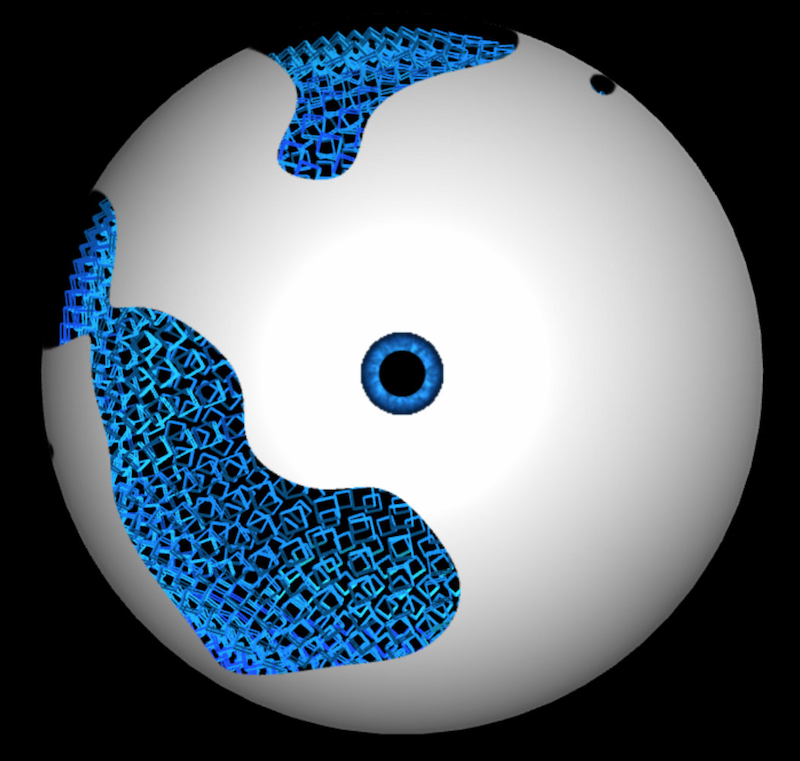
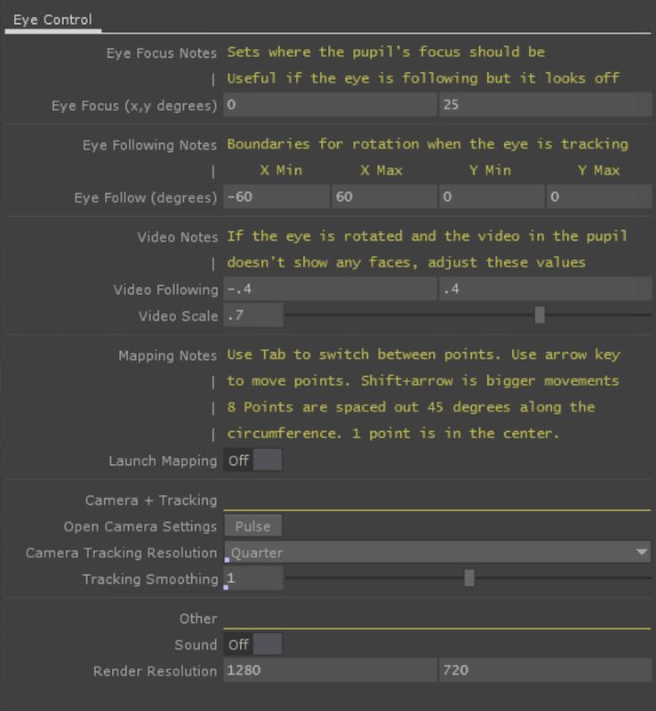
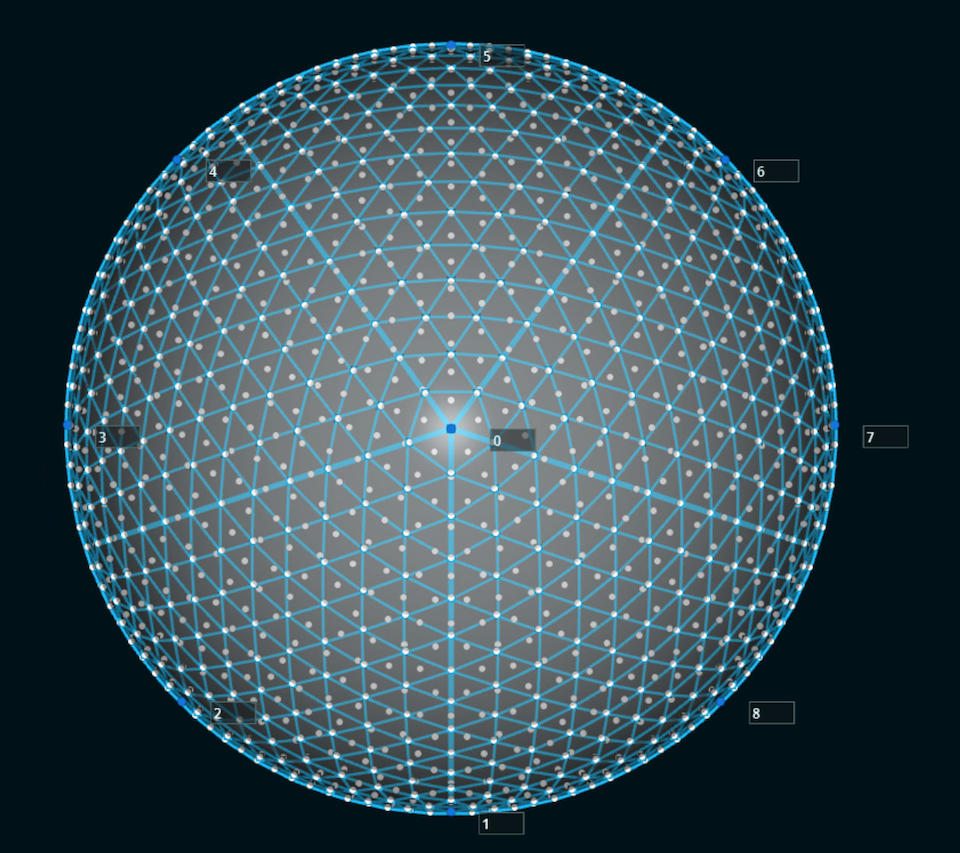

# [Tian Yan](https://vimeo.com/182222548/33bf58803d)

This project comes packaged with the [OpenCV Plugin by Xu Da](https://github.com/mourendxu/TD-OpenCV3TOP). When you initially open the project, you will need to confirm the plugin with TD.

Before launching TouchDesigner, make sure you have an external display attached. The eyeball visuals will open in the external display (monitor 1). Your computer monitor should show a set of parameters to be adjusted:

The "Launch Mapping" toggle will bring up a projection mapping interface where you can adjust the point positions of these 8 points (see the [camSchnappr Page](https://docs.derivative.ca/Palette:camSchnappr) for more details):

Make sure when you are done mapping to close the Mapping page by turning the Launch Mapping toggle off. Saving the TD project will save all your mapping and parameters settings.

### Notes for future improvement:
Filter and Lag need to be looked at again. There needs to be a smooth transition between when the eye is scanning and when it first detects a face, and also when tracking a face the eye movements needs to be smooth (not jerky) but also not too lagged behind.

How the live video feed appears in the pupil needs to be adjusted. You should never see the edges of the video. Also how it currently is setup, the video itself moves inside the pupil while the pupil stays stationary in the texture. It might be better if the video stays stationary and the pupil's "mask" moves over the stationary video.
